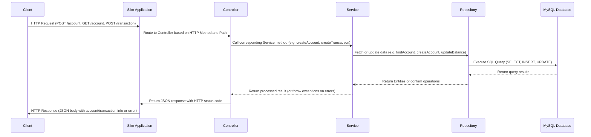

# Banking Management System (API)

This project is a RESTful API for banking management, built with the Slim Framework, MySQL persistence. It also uses Pest for automated testing and Docker for environment orchestration.

## Features

- **POST /account**: Create a new bank account with an initial balance.
- **GET /account?account_number=XXX**: Retrieve the balance of an existing account.
- **POST /transaction**: Perform transactions (debit, credit, or pix) on an account, applying the corresponding fees.

### Transaction Fees

- **Debit (D)**: 3%
- **Credit (C)**: 5%
- **Pix (P)**: 0%

If the available balance is not sufficient (considering the fee), the transaction fails and returns a 404 status.

## Technologies and Tools

- **PHP 8.3**
- **Slim Framework 4**
- **slim/psr7** for PSR-7 requests/responses
- **MySQL** as the relational database
- **Docker and Docker Compose** for containerizing the application and database
- **Pest** for automated testing

## Project Structure




## Running the Project

1.  **Prerequisites**:
    
    -   Docker and Docker Compose installed.
2.  **Starting the Containers**:  
    From the root directory, run:
    ` docker compose -f docker/docker-compose.yml up --build` 
    
    This will:
    
    -   Start MySQL with the `bank_database` database and `accounts` and `transactions` tables.
    -   Start the PHP Slim application on port 8080.
    - **Accessing the API**:

The application will be available at:  
    `http://localhost:8080`

Available endpoints:

-   `POST /account`
-   `GET /account?account_number=XXX`
-   `POST /transaction`

```bash
# Create account
curl -X POST -H "Content-Type: application/json" -d '{"account_number":234,"balance":180.37}' http://localhost:8080/account

# Retrieve account
curl http://localhost:8080/account?account_number=234

# Perform transaction (e.g., Debit of 10 with a 3% fee)
curl -X POST -H "Content-Type: application/json" -d '{"payment_method":"D","account_number":234,"value":10}' http://localhost:8080/transaction

```
## Tests

Unit tests are created with Pest.

-   Run tests locally:
 ```bash    
 vendor/bin/pest 
```
    
-   Run tests via Docker:
    
```bash  
 docker compose -f docker/docker-compose.yml run --rm app vendor/bin/pest

```
